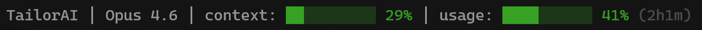

# CLI Status Bar



A universal real-time statusline for terminal-based AI coding agents. One install, multiple agents — **Claude Code**, **Cursor CLI**, **GitHub Copilot CLI**, and **Gemini CLI**. Shows your current directory, model, context window usage, and session limits at a glance.

## Supported CLI Agents

| Agent | Status | Context Bar | Usage Tracking | Install Method |
|---|---|---|---|---|
| **Claude Code** | ✅ Full support | ✅ Visual bar | ✅ OAuth API (5-hour limits) | `statusLine` config |
| **Cursor CLI** | ✅ Full support | ✅ Visual bar | ✅ Cookie-based scraping | `statusLine` config |
| **Copilot CLI** | ✅ Full support | ✅ Visual bar | ✅ GitHub token (premium reqs) | `statusLine` config (experimental) |
| **Gemini CLI** | ✅ Hook-based | ✅ Visual bar | ❌ No public API | `AfterAgent` hook |

## Why This Statusline

There are only two things that really matter when vibe-coding: **Context Window** and **Usage** left in your session. Context matters because models perform worse as context grows (context rot), and usage matters so you can squeeze every last token out of your session. This statusline keeps both front and center — across **all major CLI agents** — so you can focus on building.

## Requirements

- At least one supported CLI agent installed
- Node.js v16+ (comes with most CLI agents)
- Authenticated account (for usage tracking features)

## Installation

### Quick Install (Recommended)

```bash
npx cli-status-bar
```

Or with bun:

```bash
bunx cli-status-bar
```

The installer **auto-detects** which CLI agents you have installed and configures all of them.

### Clone & Install

```bash
git clone https://github.com/avinashbest/cli-status-bar.git
cd cli-status-bar

# macOS / Linux
./install.sh

# Windows (PowerShell)
./install.ps1
```

### Manual Install

1. **Clone the repository:**

   ```bash
   git clone https://github.com/avinashbest/cli-status-bar.git ~/.cli-status-bar
   ```

2. **Add to your CLI agent's settings:**

   **Claude Code** (`~/.claude/settings.json`):
   ```json
   {
     "statusLine": {
       "type": "command",
       "command": "node ~/.cli-status-bar/statusline.js"
     }
   }
   ```

   **Cursor CLI** (`~/.cursor/cli-config.json`):
   ```json
   {
     "statusLine": {
       "type": "command",
       "command": "node ~/.cli-status-bar/statusline.js"
     }
   }
   ```

   **Copilot CLI** (`~/.copilot/config.json`):
   ```json
   {
     "experimental": true,
     "statusLine": {
       "type": "command",
       "command": "node ~/.cli-status-bar/statusline.js"
     }
   }
   ```

   **Gemini CLI** (`~/.gemini/settings.json`):
   ```json
   {
     "hooks": {
       "AfterAgent": [{
         "matcher": "*",
         "hooks": [{
           "name": "cli-status-bar-stats",
           "type": "command",
           "command": "node ~/.cli-status-bar/src/hooks/gemini-after-agent.js"
         }]
       }]
     }
   }
   ```

3. **Restart your CLI agent** or start a new session.

## Features

- **Multi-Agent Support**: Works across Claude Code, Cursor, Copilot, and Gemini
- **Context Usage**: Visual bar showing token usage (green → yellow → orange → red 💀)
- **API Usage**: Real-time session limit tracking with countdown timer (where available)
- **Current Directory**: Shows your working directory
- **Model Name**: Displays which model you're using
- **Auto-Detection**: Automatically detects which CLI agent is calling
- **Smart Caching**: 30-second TTL cache shared across sessions
- **Adaptive Timeout**: Faster after first prompt (1.2s vs 1.5s)
- **Provider Override**: Force a specific provider via `CLI_STATUSBAR_PROVIDER` env var
- **Extra Segments**: Copilot shows lines added/removed

**Color Coding:**

- 🟢 Green: < 50% usage
- 🟡 Yellow: 50-65% usage
- 🟠 Orange: 65-80% usage
- 🔴 Red (blinking 💀): > 80% usage

## Architecture

```
cli-status-bar/
├── statusline.js              # Compatibility shim (entry point)
├── src/
│   ├── statusline.js          # Main orchestrator
│   ├── detect.js              # Provider auto-detection
│   ├── core/
│   │   ├── renderer.js        # Bar rendering, colors, formatting
│   │   ├── cache.js           # Provider-aware caching with TTL
│   │   └── config.js          # User preferences
│   ├── providers/
│   │   ├── base.js            # Abstract provider contract
│   │   ├── claude.js          # Claude Code adapter
│   │   ├── cursor.js          # Cursor CLI adapter
│   │   ├── copilot.js         # Copilot CLI adapter
│   │   └── gemini.js          # Gemini CLI adapter (hook-based)
│   └── hooks/
│       └── gemini-after-agent.js  # Gemini AfterAgent hook script
├── bin/
│   └── install.js             # npx universal installer
├── install.sh                 # Shell installer (macOS/Linux)
└── install.ps1                # PowerShell installer (Windows)
```

### How Provider Detection Works

The statusline auto-detects which CLI agent is calling it using this priority:

1. **Env var** — `CLI_STATUSBAR_PROVIDER=claude|cursor|copilot|gemini`
2. **Provider-specific env vars** — `ANTHROPIC_API_KEY`, `CURSOR_SESSION`, etc.
3. **Parent process name** — inspects the calling process
4. **Stdin JSON heuristics** — field patterns unique to each provider
5. **Config directory presence** — checks which `~/.<provider>` dirs exist
6. **Fallback** — defaults to Claude Code (backward compatible)

### Caching System

- Usage data is cached for 30 seconds per provider
- Cache files: `~/.<provider>/cache/usage-cache.json`
- All sessions share the same cache
- If API call times out, shows cached data (no lag)

### Gemini — Hook-Based Workaround

Gemini CLI doesn't have native `statusLine` support. Instead, CLI Status Bar installs an `AfterAgent` hook that writes session stats to `~/.gemini/cache/statusline-stats.json` after each agent turn. The Gemini provider adapter reads from this file. When Gemini adds native statusLine support, the adapter will auto-migrate.

## Configuration

Optional user config at `~/.config/cli-status-bar/config.json`:

```json
{
  "barWidth": 10,
  "thresholds": { "green": 50, "yellow": 75, "orange": 90 },
  "cacheTtlMs": 30000,
  "providers": {
    "claude": { "enabled": true },
    "cursor": { "enabled": true },
    "copilot": { "enabled": true },
    "gemini": { "enabled": true }
  }
}
```

## Uninstalling

1. Remove the `hooks/cli-status-bar` directory from your provider's config folder
2. Remove the `statusLine` (or `hooks`) entry from your provider's settings file
3. Optionally remove `~/.config/cli-status-bar/`

## License

MIT License — see [LICENSE](LICENSE) for details.

## Credits

Built for the terminal AI coding community.

Originally inspired by [@TahaSabir0](https://github.com/TahaSabir0/claude-statusline)'s Claude Code statusline.

---

**Star ⭐ this repo if you find it useful!**
